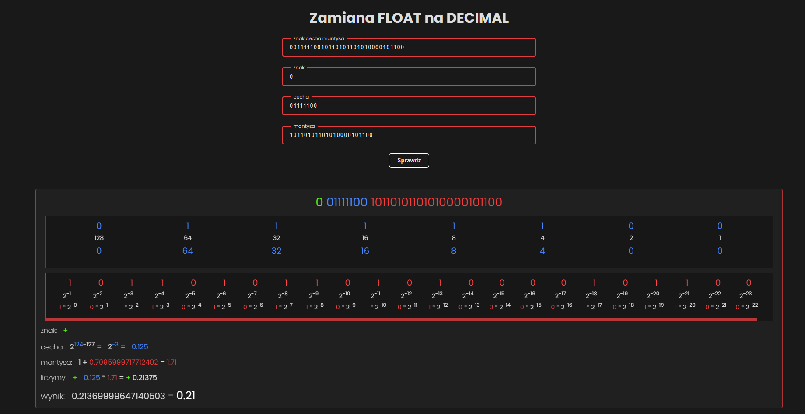

 
  
<h1 align="center">float-to-dec</h1>
  

&#xa0;

<a target="_blank" href="https://sevetoo.github.io/float-to-dec/">Demo</a>

  

  

  

  

  <a href="#dart-about">About</a> &#xa0; | &#xa0; 
  <a href="#rocket-technologies">Technologies</a> &#xa0; | &#xa0;
  <a href="#white_check_mark-requirements">Requirements</a> &#xa0; | &#xa0;
  <a href="#checkered_flag-starting">Starting</a> &#xa0; | &#xa0;
  <a href="https://github.com/SeveToo" target="_blank">Author</a>

 

## :dart: About

It is a simple project which shows IEEE 754 floating point to decimal conversion.
Zamiana liczb zmiennoprzecinkowych (float) na system dziesiętny.

## :rocket: Technologies

The following tools were used in this project:

- HTML
- CSS
- JS

## :white_check_mark: Requirements

You just need a browser.
https://sevetoo.github.io/float-to-dec/

## :checkered_flag: Starting

download the project and open **index.html**
or open in browser ( <a href="https://sevetoo.github.io/float-to-dec/" >click link</a> )

## 😎 Made by

Made with ❤ by <a href="https://github.com/SeveToo" target="_blank">SeveTo</a>

&#xa0;

<a href="#top" style="color: #fff; background: black; padding: 15px 30px">Back to top</a>
